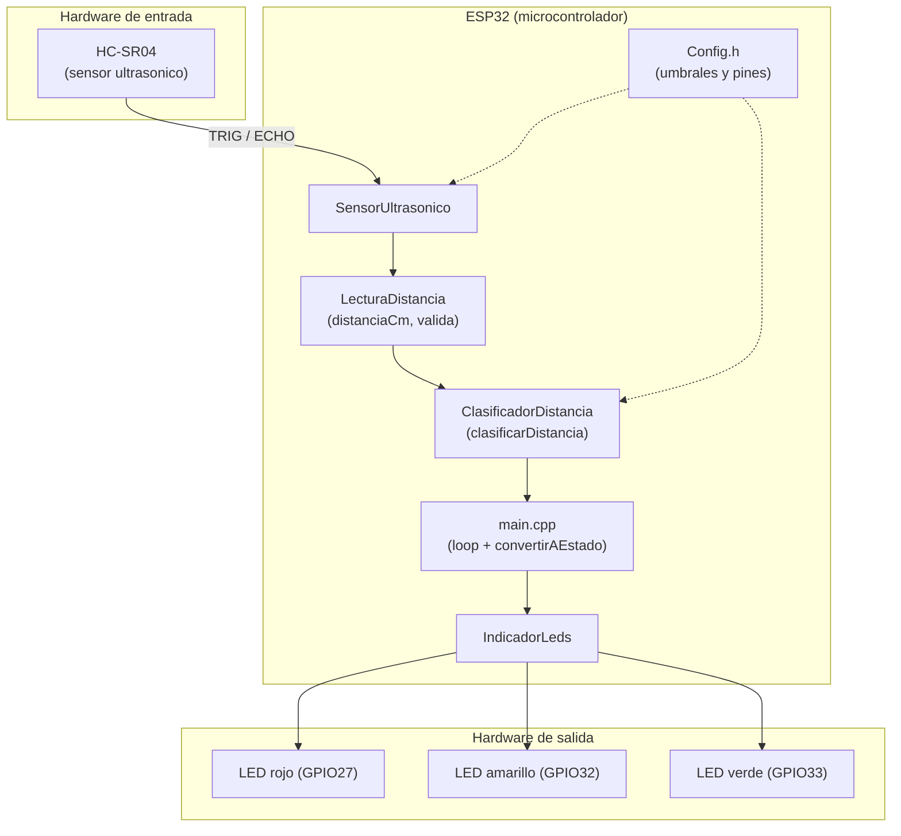
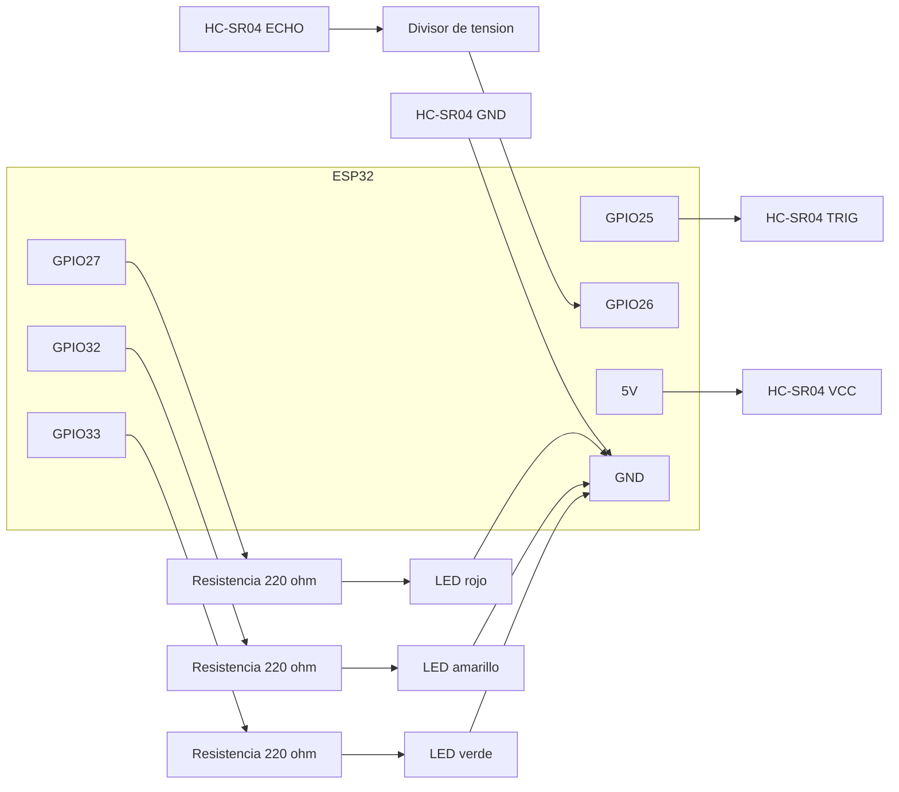
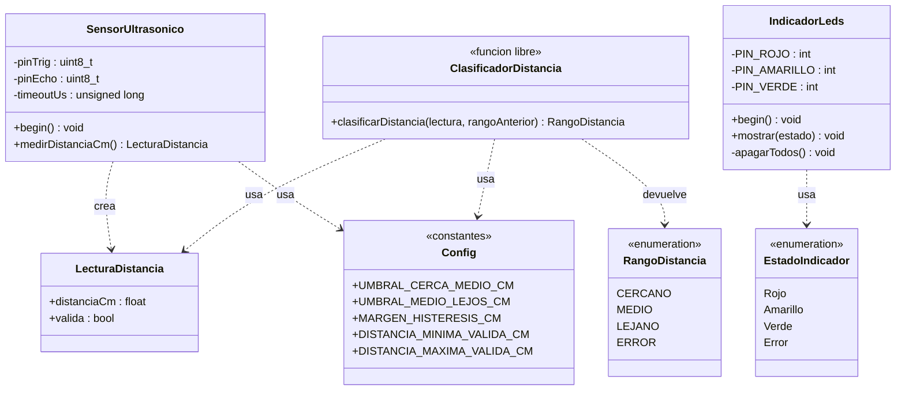
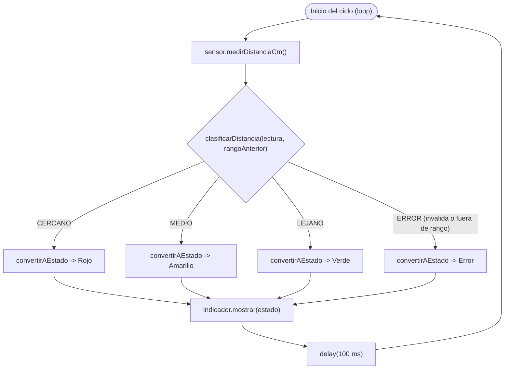
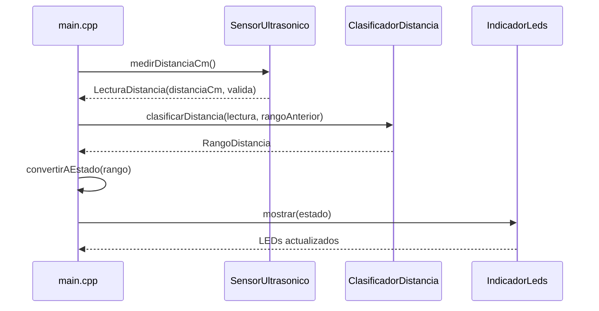

# 2. Análisis y Diseño

Diagramas basados en el flujo y la implementación real del proyecto:

`ESP32 → sensor ultrasónico → medición de distancia → validación → clasificación de distancia → conversión a estado → LEDs`

Componentes de hardware:

- ESP32
- HC-SR04 — TRIG: GPIO25, ECHO: GPIO26 (con divisor de tensión)
- LED rojo: GPIO27, LED amarillo: GPIO32, LED verde: GPIO33
- Resistencias de 220 ohm para cada LED

Módulos de software: `Config.h`, `LecturaDistancia`, `SensorUltrasonico`, `ClasificadorDistancia`, `IndicadorLeds`, `main.cpp`.

## 2.1 Diagrama de arquitectura

Muestra 3 zonas: hardware de entrada, el ESP32 con sus módulos de software, y hardware de salida. `Config.h` alimenta con constantes a `SensorUltrasonico` y `ClasificadorDistancia`; el resto de flechas sigue el flujo real de datos: HC-SR04 → SensorUltrasonico → LecturaDistancia → ClasificadorDistancia → main.cpp (que hace la conversión a estado) → IndicadorLeds → LEDs.

## 2.2 Diagrama de circuito (conexiones y pines)

No es un esquemático electrónico formal (para eso se usa Fritzing/KiCad), sino un diagrama de conexiones simplificado, suficiente para el informe.

## 2.3 Diagrama estructural

Solo se necesita un diagrama de clases: el de arquitectura (2.1) ya cubre la vista de módulos/componentes, así que no se agrega un diagrama de componentes aparte.

- `LecturaDistancia` (struct): `distanciaCm: float`, `valida: bool`
- `SensorUltrasonico` (clase): atributos privados de pines/timeout, métodos `begin()` y `medirDistanciaCm(): LecturaDistancia`
- `RangoDistancia` (enum): CERCANO, MEDIO, LEJANO, ERROR
- `ClasificadorDistancia` (función libre, no clase): `clasificarDistancia(lectura, rangoAnterior): RangoDistancia`
- `EstadoIndicador` (enum): Rojo, Amarillo, Verde, Error
- `IndicadorLeds` (clase): pines privados, métodos `begin()`, `mostrar(estado)`, `apagarTodos()` privado
- `Config` (constantes, no clase): umbrales y rango válido

## 2.4 Diagramas de comportamiento

Se usan 2: uno para el flujo de control (actividad) y otro para la interacción entre módulos (secuencia). No se agrega diagrama de estados aparte porque las transiciones de rango (con histéresis) ya se explican como parte de la actividad.

### 2.4.1 Diagrama de actividad (ciclo del `loop`)

*Nota: `clasificarDistancia` aplica internamente un margen de histéresis (2 cm) usando el rango anterior, para evitar parpadeo en los límites de 20/40 cm — por eso el diagrama lo trata como una sola decisión en vez de desglosar cada comparación.*

### 2.4.2 Diagrama de secuencia (un ciclo de medición)

