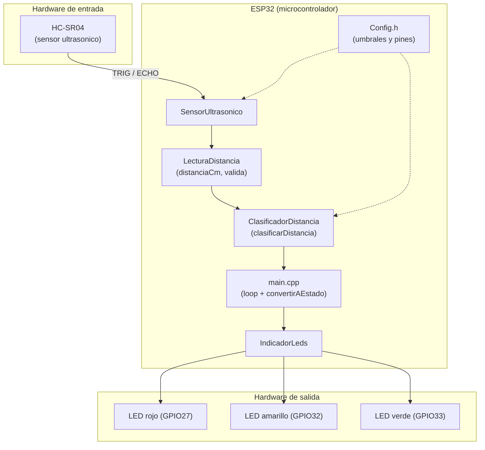
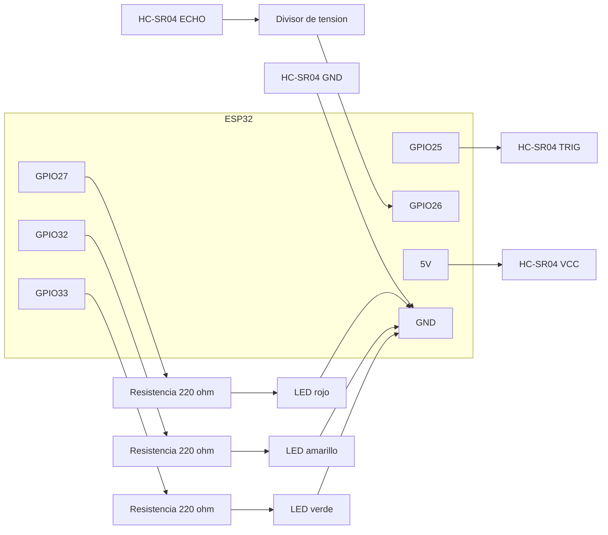
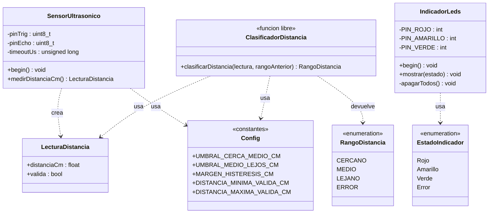
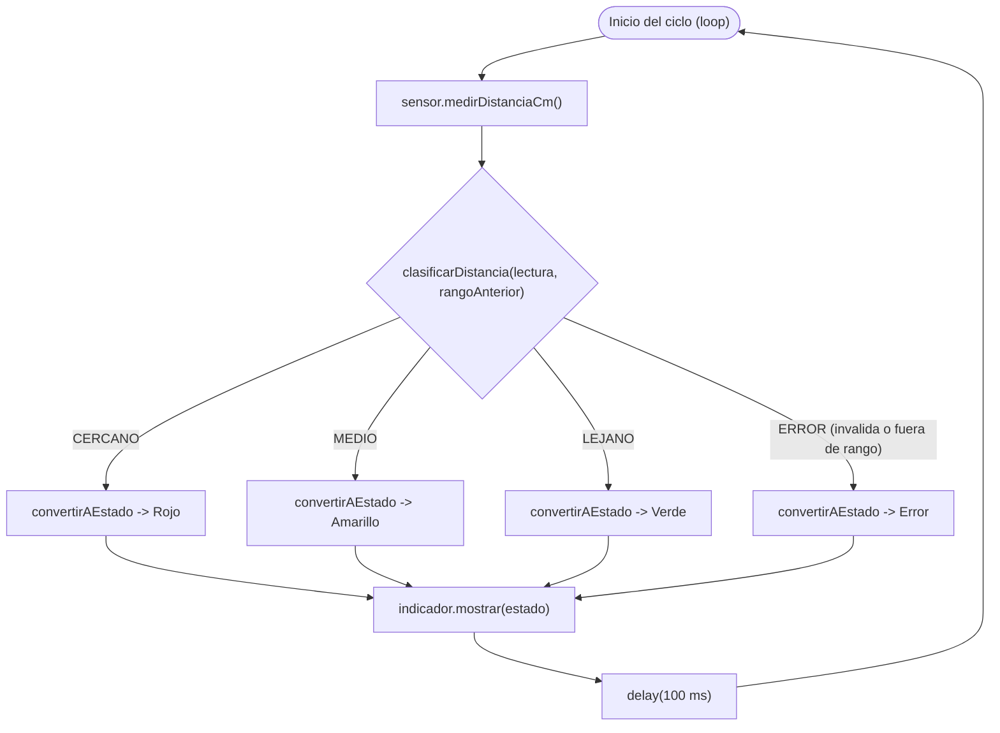
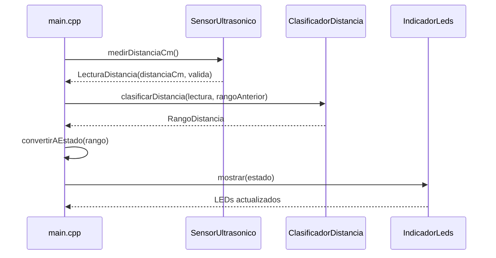
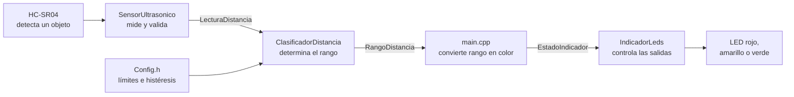

# 1. Requerimientos Funcionales y No Funcionales

## 1.1 Requerimientos funcionales

El sistema objeto inteligente está definido como un subsistema de medición y visualización de proximidad, construido sobre un ESP32, un sensor ultrasónico HC-SR04 y un conjunto de tres LEDs. El sistema debe detectar la distancia entre el sensor y un objeto, clasificar esa distancia en rangos contiguos y no solapados, y activar un actuador visual distinto para cada rango.

### 1.1.1 RF1. Medición de distancia entre sensor y objeto

El sistema debe medir la distancia entre el sensor ultrasónico HC-SR04 y un objeto presente en el campo de observación. La medida se obtiene por el módulo `SensorUltrasonico`, que dispara el pulso ultrasónico y calcula la distancia en centímetros a partir del tiempo de retorno del eco. La salida del módulo se representa mediante la estructura `LecturaDistancia`, que incluye la distancia calculada y un indicador de validez.

El comportamiento requerido es que, si la lectura es válida, la información se entregue al flujo principal de control para su clasificación. Si la lectura no se recibe o la distancia queda fuera del rango de trabajo declarado, el sistema debe marcar la lectura como inválida y no confiar en el valor para la activación de LEDs.

### 1.1.2 RF2. Interpretación y clasificación de la distancia en rangos contiguos y no solapados

El sistema debe interpretar la distancia leída y clasificarla en al menos tres rangos contiguos y sin solapamiento. La clasificación se implementa en el módulo `ClasificadorDistancia` mediante umbrales configurables y una lógica de histéresis que estabiliza la transición entre rangos.

La lógica de control documentada para el proyecto define el rango de trabajo de 2 cm a 200 cm. Los rangos de distancia y su correspondencia visual son los siguientes:

| Intervalo de distancia | LED activado | Estado visual |
|---|---|---|
| 2 cm ≤ d < 20 cm | Rojo | LED rojo encendido |
| 20 cm ≤ d < 40 cm | Amarillo | LED amarillo encendido |
| 40 cm ≤ d ≤ 200 cm | Verde | LED verde encendido |
| lectura inválida, sin eco o fuera del rango de trabajo | Apagado | los tres LEDs apagados y aviso por el puerto serie |

La representación anterior cumple la condición de disyunción de intervalos: el valor del umbral se asigna al rango superior y cada distancia pertenece a un único intervalo. La clasificación considera también el caso de lectura inválida, sin eco o fuera del rango de trabajo, que no produce activación visual y genera un aviso por el puerto serie.

La lógica de control aplica además un margen de estabilidad de 2 cm alrededor de cada umbral para evitar oscilaciones del LED cuando el objeto queda justo en el límite de transición. Este margen se documenta como decisión de diseño: el cambio de rango solo se produce cuando la distancia supera el umbral por ese margen de estabilidad. Por ejemplo, la transición entre el rango cercano y el rango medio se produce al superar 20 cm en 2 cm, es decir, cuando la distancia pasa de un valor cercano a 18 cm o se mantiene por debajo de 20 cm, y el cambio hacia el siguiente rango solo ocurre si la distancia supera el umbral por el margen definido. La misma regla aplica en el umbral de 40 cm. La política de margen es compatible con el error de medición declarado de ±3 cm con respecto a una cinta métrica, porque la decisión de cambio de rango no se activa en un punto exacto del umbral sino con una zona de tolerancia documentada.

### 1.1.3 RF3. Activación de los actuadores según el rango detectado

El sistema debe activar los actuadores de forma diferenciada según el rango detectado. El módulo `IndicadorLeds` recibe un `EstadoIndicador` y activa un LED distinto para cada nivel de proximidad: rojo para el rango cercano, amarillo para el rango medio, y verde para el rango lejano. El estado de error o lectura inválida se representa mediante apagado de todos los LEDs y un mensaje de aviso por el puerto serie.

La interacción entre módulos se coordina desde `main.cpp`, que realiza el ciclo de lectura, clasificación, conversión del rango a un estado de indicador y envío del comando de visualización. El comportamiento requerido es determinista y consistente con los rangos definidos en RF2: una sola salida de hardware debe quedar encendida para cada lectura válida y los LEDs restantes deben permanecer apagados.

## 1.2 Requerimientos no funcionales

Los requerimientos no funcionales deben expresarse con valores medibles y verificables en las pruebas. Los valores declarados a continuación constituyen objetivos de diseño para la validación del sistema.

### 1.2.1 RNF1. Estabilidad operativa

El sistema debe operar de forma continua durante al menos 10 minutos sin reinicios ni bloqueos. La estabilidad se verificará en pruebas de funcionamiento ininterrumpido, con monitoreo del comportamiento del sistema y ausencia de reseteos del microcontrolador o de la secuencia de lectura y visualización.

### 1.2.2 RNF2. Exactitud de medición

La exactitud de medición del sistema se define como un error máximo de ±3 cm respecto a una cinta métrica, dentro del rango de trabajo declarado de 2 cm a 200 cm. La medición se realizará en condiciones de ensayo controladas, comparando la distancia calculada por `SensorUltrasonico` con la referencia física aplicada mediante una cinta métrica.

### 1.2.3 RNF3. Tiempo de respuesta

El LED debe reflejar el cambio de rango en menos de 1 segundo desde que la distancia observada entra en un nuevo intervalo. El tiempo de respuesta se mide entre la lectura nueva, la actualización del rango por el clasificador y la activación del LED correspondiente por `IndicadorLeds`.

### 1.2.4 RNF4. Frecuencia de muestreo

El sistema debe realizar al menos 2 lecturas de distancia por segundo. Esta frecuencia es la base para mantener una respuesta visual estable y consistente en el indicador de proximidad, sin depender de una sola lectura aislada.

### 1.2.5 RNF5. Calidad del código

El código debe ser legible, modular, orientado a objetos y documentado, además de mantener convenciones de codificación consistentes. La estructura del firmware debe separar el acceso al sensor, la lógica de clasificación y la representación física de los LEDs. La documentación textual y los nombres de archivos, clases, estructuras y funciones deben reflejar el dominio del problema y facilitar el mantenimiento.

## 1.3 Tabla de trazabilidad de requerimientos

| Identificador | Requerimiento | Módulo principal responsable | Prueba de verificación |
|---|---|---|---|
| RF1 | Medición de distancia entre sensor y objeto | `SensorUltrasonico` y `main.cpp` | `PR-SENSOR-001` |
| RF2 | Interpretación y clasificación en rangos contiguos y sin solapamiento | `ClasificadorDistancia` y `main.cpp` | `PR-CLASIFICACION-001` |
| RF3 | Activación de actuadores según rango detectado | `IndicadorLeds` y `main.cpp` | `PR-INDICADOR-001` |
| RNF1 | Estabilidad operativa durante al menos 10 minutos | `main.cpp`, `SensorUltrasonico`, `ClasificadorDistancia`, `IndicadorLeds` | `PR-ESTABILIDAD-001` |
| RNF2 | Exactitud de medición de ±3 cm en rango de 2 a 200 cm | `SensorUltrasonico` y `main.cpp` | `PR-EXACTITUD-001` |
| RNF3 | Tiempo de respuesta de cambio de LED menor a 1 segundo | `ClasificadorDistancia`, `IndicadorLeds` y `main.cpp` | `PR-RESPUESTA-001` |
| RNF4 | Frecuencia de muestreo mínima de 2 lecturas por segundo | `SensorUltrasonico` y `main.cpp` | `PR-MUESTREO-001` |
| RNF5 | Calidad del código: legible, modular, OO, documentado y consistente | `SensorUltrasonico`, `ClasificadorDistancia`, `IndicadorLeds`, `main.cpp` | `PR-CALIDAD-CODIGO-001` |

# 2. Análisis y Diseño

Diagramas basados en el flujo y la implementación real del proyecto:

`ESP32 → sensor ultrasónico → medición de distancia → validación → clasificación de distancia → conversión a estado → LEDs`

Componentes de hardware:

- ESP32
- HC-SR04 — TRIG: GPIO25, ECHO: GPIO26 (con divisor de tensión)
- LED rojo: GPIO27, LED amarillo: GPIO32, LED verde: GPIO33
- Resistencias de 220 ohm para cada LED

Módulos de software: `Config.h`, `LecturaDistancia`, `SensorUltrasonico`, `ClasificadorDistancia`, `IndicadorLeds`, `main.cpp`.

## 2.1 Diagrama de arquitectura

Muestra 3 zonas: hardware de entrada, el ESP32 con sus módulos de software, y hardware de salida. `Config.h` alimenta con constantes a `SensorUltrasonico` y `ClasificadorDistancia`; el resto de flechas sigue el flujo real de datos: HC-SR04 → SensorUltrasonico → LecturaDistancia → ClasificadorDistancia → main.cpp (que hace la conversión a estado) → IndicadorLeds → LEDs.



## 2.2 Diagrama de circuito (conexiones y pines)

No es un esquemático electrónico formal (para eso se usa Fritzing/KiCad), sino un diagrama de conexiones simplificado, suficiente para el informe.



## 2.3 Diagrama estructural

Solo se necesita un diagrama de clases: el de arquitectura (2.1) ya cubre la vista de módulos/componentes, así que no se agrega un diagrama de componentes aparte.

- `LecturaDistancia` (struct): `distanciaCm: float`, `valida: bool`
- `SensorUltrasonico` (clase): atributos privados de pines/timeout, métodos `begin()` y `medirDistanciaCm(): LecturaDistancia`
- `RangoDistancia` (enum): CERCANO, MEDIO, LEJANO, ERROR
- `ClasificadorDistancia` (función libre, no clase): `clasificarDistancia(lectura, rangoAnterior): RangoDistancia`
- `EstadoIndicador` (enum): Rojo, Amarillo, Verde, Error
- `IndicadorLeds` (clase): pines privados, métodos `begin()`, `mostrar(estado)`, `apagarTodos()` privado
- `Config` (constantes, no clase): umbrales y rango válido



## 2.4 Diagramas de comportamiento

Se usan 2: uno para el flujo de control (actividad) y otro para la interacción entre módulos (secuencia). No se agrega diagrama de estados aparte porque las transiciones de rango (con histéresis) ya se explican como parte de la actividad.

### 2.4.1 Diagrama de actividad (ciclo del `loop`)



*Nota: `clasificarDistancia` aplica internamente un margen de histéresis (2 cm) usando el rango anterior, para evitar parpadeo en los límites de 20/40 cm — por eso el diagrama lo trata como una sola decisión en vez de desglosar cada comparación.*

### 2.4.2 Diagrama de secuencia (un ciclo de medición)



## 3. Desarrollo e Implementación

### 3.1 Enfoque de implementación

El prototipo fue desarrollado en C++ utilizando el framework Arduino y PlatformIO para una placa ESP32. La implementación integra un sensor ultrasónico HC-SR04 y tres LEDs que representan visualmente la distancia detectada. El programa mide la distancia, valida la lectura, la clasifica en uno de tres rangos y activa un único LED de acuerdo con el resultado.

Para mantener el código organizado, cada parte del sistema posee una responsabilidad concreta:

- `SensorUltrasonico` se comunica con el HC-SR04 y transforma la duración del eco en una distancia expresada en centímetros.
- `ClasificadorDistancia` valida la distancia de trabajo y determina si el objeto se encuentra en el rango cercano, medio o lejano.
- `IndicadorLeds` controla las salidas físicas y garantiza que solamente permanezca encendido el LED correspondiente.
- `main.cpp` coordina los tres módulos sin contener los detalles internos de medición ni de control eléctrico.
- `LecturaDistancia` constituye el dato compartido entre el sensor y el clasificador.
- `Config.h` concentra los límites de clasificación para que puedan modificarse sin reescribir el algoritmo.

Esta distribución aplica una combinación intencional de programación orientada a objetos y funciones independientes. Las partes que representan dispositivos físicos se implementaron como clases, debido a que conservan información propia como pines y parámetros de funcionamiento. La clasificación, al no necesitar controlar hardware, se implementó como una función separada y reutilizable.

El flujo implementado es el siguiente:



### 3.2 Entorno y herramientas

| Elemento | Selección utilizada | Función dentro del proyecto |
| --- | --- | --- |
| Microcontrolador | ESP32 Dev Module | Ejecuta el algoritmo y controla las entradas y salidas. |
| Framework | Arduino | Proporciona las funciones de control de pines, temporización y lectura del pulso. |
| Lenguaje | C++ | Permite organizar el sistema mediante clases, estructuras, enumeraciones y funciones. |
| Entorno de construcción | PlatformIO | Gestiona la plataforma ESP32 y la generación del firmware. |
| Sensor | HC-SR04 | Obtiene la distancia entre el prototipo y un objeto. |
| Actuadores | Tres LEDs | Representan los rangos cercano, medio y lejano. |

La plataforma utilizada está declarada en [`platformio.ini`](../platformio.ini):

```ini
[env:esp32dev]
platform = espressif32
board = esp32dev
framework = arduino
```

### 3.3 Organización del código fuente

El código se encuentra dividido en archivos de interfaz (`.h`) e implementación (`.cpp`). Los encabezados indican qué datos y operaciones ofrece cada módulo, mientras que los archivos `.cpp` contienen su funcionamiento interno.

| Archivo | Responsabilidad |
| --- | --- |
| [`src/main.cpp`](../src/main.cpp) | Inicializa los módulos y coordina el ciclo completo de medición, clasificación y señalización. |
| [`src/LecturaDistancia.h`](../src/LecturaDistancia.h) | Define el formato común utilizado para transferir una lectura. |
| [`src/SensorUltrasonico.h`](../src/SensorUltrasonico.h) | Declara la clase del sensor, sus operaciones públicas y sus parámetros internos. |
| [`src/SensorUltrasonico.cpp`](../src/SensorUltrasonico.cpp) | Genera el pulso de disparo, mide el eco, calcula la distancia y determina si la lectura es válida. |
| [`src/ClasificadorDistancia.h`](../src/ClasificadorDistancia.h) | Declara los posibles rangos y la función de clasificación. |
| [`src/ClasificadorDistancia.cpp`](../src/ClasificadorDistancia.cpp) | Implementa los límites, la validación del rango de trabajo y la histéresis. |
| [`src/Config.h`](../src/Config.h) | Centraliza los umbrales y límites configurables del clasificador. |
| [`src/IndicadorLeds.h`](../src/IndicadorLeds.h) | Declara los estados visuales, los pines y las operaciones del indicador. |
| [`src/IndicadorLeds.cpp`](../src/IndicadorLeds.cpp) | Configura los GPIO y enciende el LED correspondiente al estado recibido. |

La dependencia entre los archivos está controlada mediante inclusiones explícitas. Por ejemplo, tanto el sensor como el clasificador incluyen `LecturaDistancia.h`, por lo que ambos intercambian exactamente el mismo tipo de dato. De esta manera se evita duplicar estructuras incompatibles o convertir manualmente los nombres de sus campos.

### 3.4 Dato compartido: `LecturaDistancia`

El sensor no devuelve únicamente un número. Una distancia numérica por sí sola no permite distinguir una medición real de un error producido por ausencia de eco. Para solucionar este problema se definió la estructura `LecturaDistancia`:

```cpp
struct LecturaDistancia {
    float distanciaCm;
    bool valida;
};
```

Sus campos tienen el siguiente propósito:

| Campo | Significado |
| --- | --- |
| `distanciaCm` | Distancia calculada en centímetros. |
| `valida` | Indica si la medición puede utilizarse. Es `false` cuando no se recibe eco o la distancia está fuera del rango físico aceptado. |

Esta estructura establece un contrato común entre módulos: `SensorUltrasonico` la produce, `main.cpp` la recibe y `ClasificadorDistancia` la procesa. Con ello, la información de validez acompaña siempre al valor medido.

### 3.5 Implementación del sensor ultrasónico

#### 3.5.1 Configuración del dispositivo

La clase `SensorUltrasonico` conserva como información privada el pin de disparo, el pin de eco y el tiempo máximo de espera. Su constructor permite reemplazar esos valores, pero utiliza por defecto la configuración del prototipo:

```cpp
SensorUltrasonico(
    uint8_t pinTrig = 25,
    uint8_t pinEcho = 26,
    unsigned long timeoutUs = 30000
);
```

Por tanto, la instancia declarada en `main.cpp` utiliza:

| Parámetro | Valor | Finalidad |
| --- | ---: | --- |
| TRIG | GPIO25 | Envía el pulso que inicia la medición. |
| ECHO | GPIO26 | Recibe el pulso cuyo tiempo representa el recorrido del sonido. |
| Tiempo máximo | 30 000 µs | Evita una espera indefinida cuando no se recibe eco. |

El método `begin()` se ejecuta una vez durante el arranque. Configura TRIG como salida, ECHO como entrada y deja TRIG inicialmente en nivel bajo:

```cpp
void SensorUltrasonico::begin() {
    pinMode(_pinTrig, OUTPUT);
    pinMode(_pinEcho, INPUT);
    digitalWrite(_pinTrig, LOW);
}
```

#### 3.5.2 Proceso de medición

El método `medirDistanciaCm()` realiza la medición mediante los siguientes pasos:

1. Crea una lectura inicial con distancia `0.0` y validez `false`.
2. Mantiene TRIG en nivel bajo durante 2 µs para producir un inicio limpio.
3. Coloca TRIG en nivel alto durante 10 µs para solicitar una medición.
4. Utiliza `pulseIn()` para medir cuánto tiempo permanece activo el pulso recibido por ECHO.
5. Si no llega un eco antes del tiempo máximo, devuelve la lectura inválida inicial.
6. Si llega el eco, convierte su duración en una distancia.
7. Acepta el resultado físico únicamente cuando está entre 2 y 400 cm.

La conversión implementada es:

```cpp
float distancia =
    (duracionUs * VELOCIDAD_SONIDO_CM_US) / 2.0f;
```

La constante `VELOCIDAD_SONIDO_CM_US` tiene el valor `0.0343`, correspondiente a la velocidad aproximada del sonido expresada en centímetros por microsegundo. El resultado se divide entre dos porque el tiempo medido incluye el recorrido de ida hacia el objeto y el recorrido de vuelta hacia el sensor.

La validación física se realiza antes de informar que el resultado es confiable:

```cpp
if (duracionUs == 0) {
    return lectura;
}

if (distancia < DISTANCIA_MIN_CM ||
    distancia > DISTANCIA_MAX_CM) {
    return lectura;
}

lectura.distanciaCm = distancia;
lectura.valida = true;
```

Así se satisface el requerimiento **RF1**, ya que el sistema obtiene una distancia real y también identifica explícitamente los casos en los que no fue posible medirla de forma confiable.

### 3.6 Implementación del clasificador de distancia

El clasificador recibe la lectura producida por el sensor y devuelve uno de los valores definidos por `RangoDistancia`:

```cpp
enum class RangoDistancia {
    CERCANO,
    MEDIO,
    LEJANO,
    ERROR
};
```

La función pública tiene dos entradas:

```cpp
RangoDistancia clasificarDistancia(
    const LecturaDistancia& lectura,
    RangoDistancia rangoAnterior
);
```

- `lectura` contiene la distancia actual y su estado de validez.
- `rangoAnterior` conserva el resultado del ciclo anterior para estabilizar los cambios cerca de los límites.

#### 3.6.1 Parámetros configurables

Los valores de clasificación se encuentran centralizados en `Config.h`:

```cpp
constexpr float UMBRAL_CERCA_MEDIO_CM = 20.0f;
constexpr float UMBRAL_MEDIO_LEJOS_CM = 40.0f;
constexpr float MARGEN_HISTERESIS_CM = 2.0f;
constexpr float DISTANCIA_MINIMA_VALIDA_CM = 2.0f;
constexpr float DISTANCIA_MAXIMA_VALIDA_CM = 200.0f;
```

El uso de `constexpr` permite tratar estos valores como constantes del programa e impide que sean modificados accidentalmente durante la ejecución. Además, su ubicación centralizada facilita ajustar el comportamiento sin alterar la función de clasificación.

Cuando no existe un rango anterior confiable, la clasificación base es:

| Distancia recibida | Clasificación |
| --- | --- |
| Menor que 2 cm | `ERROR` |
| Desde 2 cm hasta menos de 20 cm | `CERCANO` |
| Desde 20 cm hasta menos de 40 cm | `MEDIO` |
| Desde 40 cm hasta 200 cm | `LEJANO` |
| Mayor que 200 cm | `ERROR` |

Los intervalos válidos son contiguos y no presentan solapamientos. El valor exacto de 20 cm pertenece a `MEDIO`, mientras que 40 cm pertenece a `LEJANO`. Esto satisface el requerimiento **RF2** de dividir las mediciones en al menos tres rangos claramente definidos.

#### 3.6.2 Validación y manejo de errores

La función comprueba primero la validez indicada por el sensor:

```cpp
if (!lectura.valida) {
    return RangoDistancia::ERROR;
}
```

Luego aplica el rango de trabajo definido para la aplicación:

```cpp
if (distancia < DISTANCIA_MINIMA_VALIDA_CM ||
    distancia > DISTANCIA_MAXIMA_VALIDA_CM) {
    return RangoDistancia::ERROR;
}
```

El sensor admite físicamente valores de hasta 400 cm, mientras que el clasificador restringe el funcionamiento del prototipo a 200 cm. Esta separación es deliberada: el sensor determina si la lectura es físicamente posible y el clasificador decide si está dentro del rango útil definido para esta práctica.

#### 3.6.3 Estabilización mediante histéresis

Las mediciones ultrasónicas pueden variar ligeramente aunque el objeto permanezca quieto. Sin una estabilización, valores como 19.9 y 20.1 cm provocarían cambios repetidos entre los LEDs rojo y amarillo. Para evitarlo se utiliza un margen de 2 cm y el rango obtenido en el ciclo anterior.

| Rango anterior | Condición para cambiar | Comportamiento resultante |
| --- | --- | --- |
| `ERROR` | Primera lectura válida | Clasifica directamente con los límites de 20 y 40 cm. |
| `CERCANO` | La distancia alcanza al menos 22 cm | Puede cambiar a `MEDIO` o directamente a `LEJANO`. |
| `MEDIO` | Baja de 18 cm | Cambia a `CERCANO`. |
| `MEDIO` | Alcanza al menos 42 cm | Cambia a `LEJANO`. |
| `LEJANO` | Baja de 38 cm | Puede cambiar a `MEDIO` o directamente a `CERCANO`. |

Por ejemplo, si el sistema se encuentra en `CERCANO`, una secuencia de 19, 21, 19 y 21 cm conserva el mismo rango. El cambio a `MEDIO` ocurre al alcanzar 22 cm. Esta decisión reduce oscilaciones visuales y contribuye a la estabilidad solicitada por los requerimientos no funcionales.

### 3.7 Implementación del indicador de LEDs

El indicador representa los resultados del clasificador mediante una enumeración orientada al actuador:

```cpp
enum class EstadoIndicador {
    Rojo,
    Amarillo,
    Verde,
    Error
};
```

La clase asigna los siguientes pines:

| LED | GPIO | Estado asociado |
| --- | ---: | --- |
| Rojo | 27 | Objeto cercano. |
| Amarillo | 32 | Objeto a distancia media. |
| Verde | 33 | Objeto lejano dentro del rango de trabajo. |

El método `begin()` configura los tres pines como salidas y llama a `apagarTodos()`. Con ello, el sistema inicia en un estado seguro y definido.

El método `mostrar()` apaga primero todos los LEDs y después enciende solamente el correspondiente:

```cpp
void IndicadorLeds::mostrar(EstadoIndicador estado) {
    apagarTodos();

    switch (estado) {
        case EstadoIndicador::Rojo:
            digitalWrite(PIN_ROJO, HIGH);
            break;
        case EstadoIndicador::Amarillo:
            digitalWrite(PIN_AMARILLO, HIGH);
            break;
        case EstadoIndicador::Verde:
            digitalWrite(PIN_VERDE, HIGH);
            break;
        case EstadoIndicador::Error:
            break;
    }
}
```

La llamada previa a `apagarTodos()` evita que queden dos colores encendidos al cambiar de rango. Cuando se recibe `Error`, no se activa ningún LED, por lo que una lectura inválida queda representada mediante los tres indicadores apagados.

### 3.8 Integración de los módulos en `main.cpp`

`main.cpp` actúa como coordinador general. Crea una instancia del sensor, una instancia del indicador y una variable que conserva el rango anterior:

```cpp
SensorUltrasonico sensor;
IndicadorLeds indicador;

RangoDistancia rangoAnterior = RangoDistancia::ERROR;
```

La inicialización se realiza una sola vez en `setup()`:

```cpp
void setup() {
    sensor.begin();
    indicador.begin();
}
```

El ciclo principal implementa la integración completa:

```cpp
void loop() {
    LecturaDistancia lectura = sensor.medirDistanciaCm();

    rangoAnterior = clasificarDistancia(lectura, rangoAnterior);

    EstadoIndicador estado = convertirAEstado(rangoAnterior);
    indicador.mostrar(estado);

    delay(100);
}
```

Cada repetición ejecuta cinco acciones:

1. Solicita una medición al módulo ultrasónico.
2. Entrega la lectura y el rango anterior al clasificador.
3. Guarda el nuevo rango para utilizarlo en la siguiente medición.
4. Convierte el concepto de distancia en un estado visual.
5. Solicita al indicador que encienda el LED correspondiente.

La conversión entre rango y color se mantiene en `main.cpp` para evitar que el clasificador dependa de los LEDs:

```cpp
EstadoIndicador convertirAEstado(RangoDistancia rango) {
    switch (rango) {
        case RangoDistancia::CERCANO:
            return EstadoIndicador::Rojo;
        case RangoDistancia::MEDIO:
            return EstadoIndicador::Amarillo;
        case RangoDistancia::LEJANO:
            return EstadoIndicador::Verde;
        case RangoDistancia::ERROR:
        default:
            return EstadoIndicador::Error;
    }
}
```

Esta decisión conserva la independencia de los módulos. El clasificador expresa qué tan lejos está el objeto, el indicador conoce los colores disponibles y `main.cpp` establece la relación entre ambos. Así se satisface **RF3**, ya que cada rango produce un comportamiento visual diferente.

### 3.9 Correspondencia entre requerimientos e implementación

| Requerimiento | Implementación responsable | Evidencia en el código |
| --- | --- | --- |
| **RF1. Medir la distancia** | `SensorUltrasonico` y `LecturaDistancia` | Generación del pulso, lectura de ECHO, cálculo en centímetros y validación del resultado. |
| **RF2. Clasificar en tres rangos** | `ClasificadorDistancia` y `Config.h` | Rangos `CERCANO`, `MEDIO` y `LEJANO`, con límites contiguos en 20 y 40 cm. |
| **RF3. Activar actuadores según el rango** | `convertirAEstado()`, `IndicadorLeds` y `main.cpp` | Conversión de cada rango en un color y activación exclusiva del GPIO correspondiente. |
| **Estabilidad** | Histéresis y tiempo máximo del sensor | Margen de 2 cm para evitar oscilaciones y timeout de 30 000 µs ante ausencia de eco. |
| **Tiempo de respuesta** | Ciclo principal | Se realiza una nueva iteración después de una espera de 100 ms. El valor definitivo debe verificarse físicamente. |
| **Frecuencia de muestreo** | `loop()` y `delay(100)` | La implementación busca varias mediciones por segundo; la frecuencia real debe medirse durante las pruebas. |
| **Exactitud** | Fórmula de conversión y validación física | Usa la velocidad nominal del sonido y descarta resultados fuera de 2–400 cm; el error real debe compararse con una referencia física. |
| **Modularidad y legibilidad** | División en clases, función pura, estructura compartida y constantes | Cada módulo tiene una responsabilidad identificable y una interfaz limitada. |

La tabla diferencia las características implementadas de aquellas que todavía requieren evidencia experimental. La estabilidad continua, el tiempo real de respuesta, la frecuencia efectiva y el error de medición no se presentan aquí como resultados comprobados; su verificación corresponde a la sección de Pruebas y Validaciones.

### 3.10 Buenas prácticas aplicadas

Durante la implementación se aplicaron las siguientes decisiones para mejorar la calidad y mantenibilidad del código:

- **Responsabilidad única:** el sensor mide, el clasificador decide, el indicador actúa y `main.cpp` coordina.
- **Encapsulamiento:** los pines y parámetros internos de las clases no se modifican directamente desde otros módulos.
- **Tipo de dato compartido:** `LecturaDistancia` evita estructuras duplicadas y mantiene unidos el valor y su validez.
- **Enumeraciones explícitas:** `RangoDistancia` y `EstadoIndicador` evitan utilizar números sin significado para representar estados.
- **Configuración centralizada:** los límites se encuentran en `Config.h` y no dispersos por el programa.
- **Constantes de compilación:** `constexpr` impide modificaciones accidentales de los umbrales y pines.
- **Manejo seguro de errores:** la ausencia de eco, las distancias físicas inválidas y las distancias fuera del rango de trabajo conducen a un estado conocido.
- **Salida exclusiva:** antes de encender un LED se apagan los tres, evitando estados visuales contradictorios.
- **Separación entre interfaz e implementación:** los archivos `.h` publican las operaciones necesarias y los `.cpp` contienen sus detalles.
- **Nombres descriptivos:** identificadores como `medirDistanciaCm`, `clasificarDistancia`, `rangoAnterior` y `apagarTodos` permiten comprender la intención del código.

En conjunto, la implementación cubre el recorrido completo desde la adquisición del dato físico hasta la respuesta visual. La estructura permite modificar los límites, sustituir el indicador o probar la clasificación sin reescribir el control del sensor, lo cual facilita el mantenimiento, la explicación durante la defensa y la ampliación futura del prototipo.

